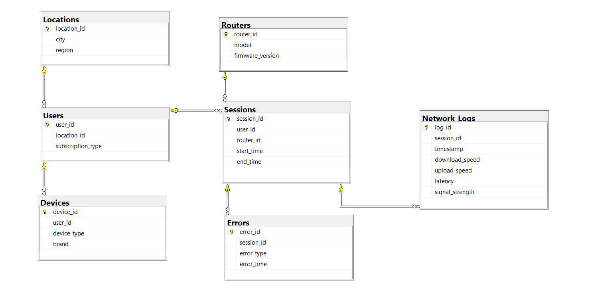
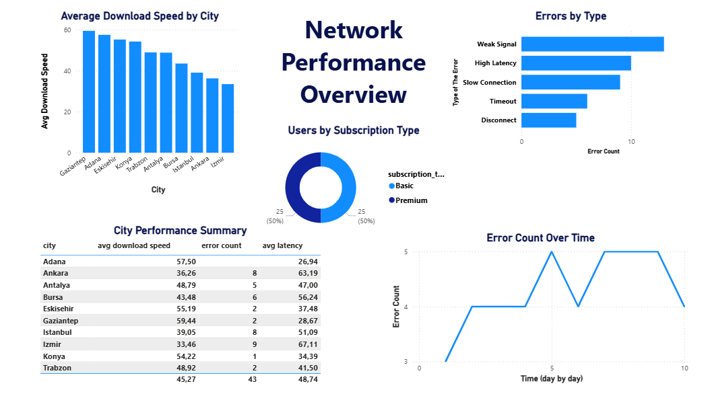
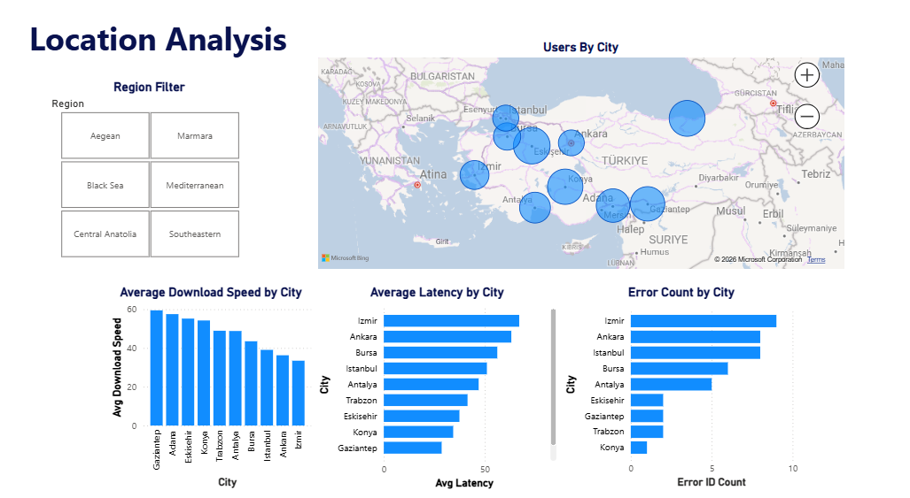
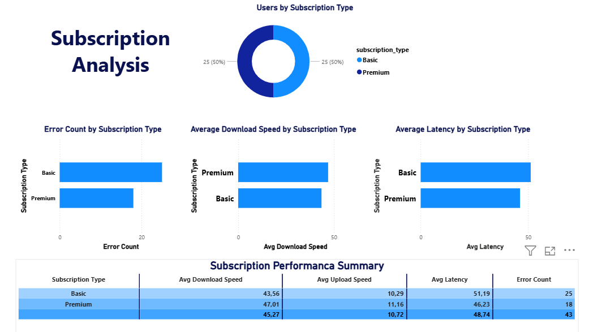
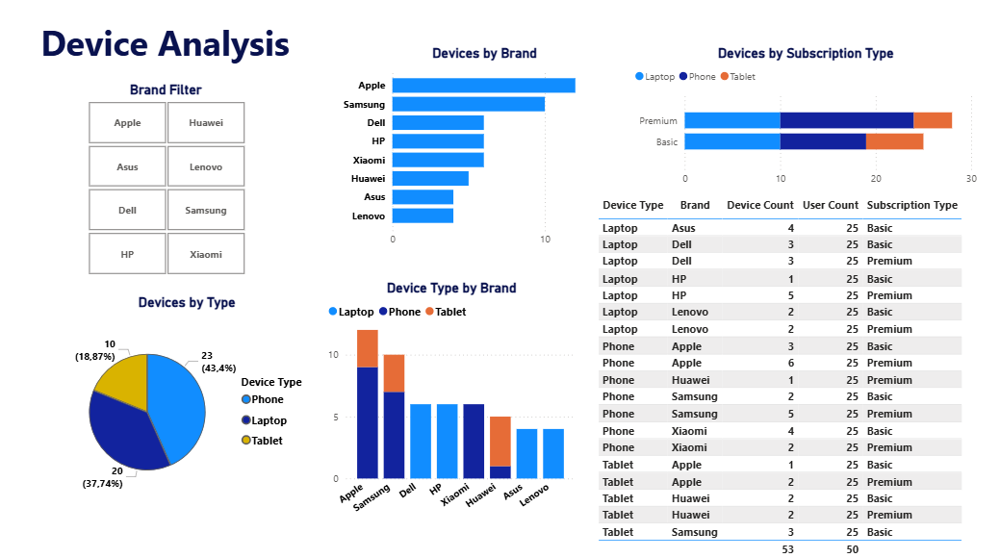
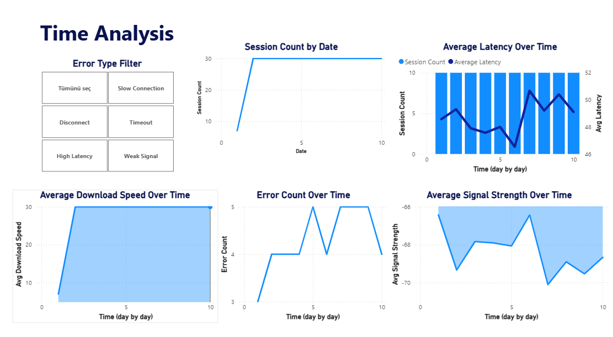
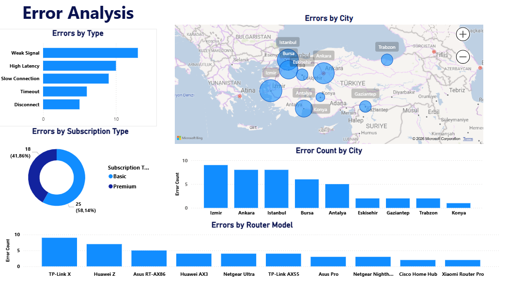
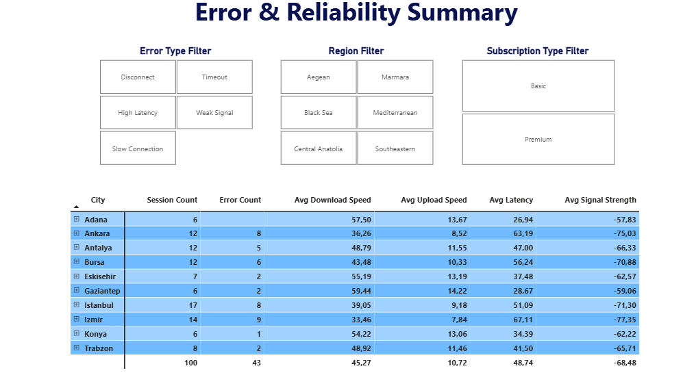

# Internet Performance Analytics System

This project is a SQL Server and Power BI data analytics project designed to analyze synthetic internet performance data. The project focuses on users, locations, devices, routers, internet sessions, network performance logs, and connection errors.

The main goal of the project is to show how relational database design, SQL queries, and Power BI dashboards can be used together to analyze network performance and reliability.

## Tech Stack

* Microsoft SQL Server
* T-SQL
* Power BI
* Relational Database Design
* Data Modeling
* Data Visualization

## Project Overview

In this project, I designed and implemented a relational database for an internet performance analytics scenario. The database includes seven related tables and stores information about users, their devices, locations, routers, sessions, network performance measurements, and connection errors.

After creating the database, I wrote SQL JOIN queries, views, and stored procedures to analyze the data from different perspectives. Then, I connected the database to Power BI and created interactive report pages to visualize performance, errors, and reliability metrics.

## Dataset

The dataset used in this project is synthetic. It was generated based on realistic assumptions because real-world telecom or internet service provider data is not publicly accessible for this type of project.

The database includes the following tables:

| Table        | Description                                          |
| ------------ | ---------------------------------------------------- |
| Locations    | Stores city and region information                   |
| Users        | Stores user subscription and location information    |
| Devices      | Stores device type and brand information             |
| Routers      | Stores router model and firmware version information |
| Sessions     | Stores internet connection sessions                  |
| Network_Logs | Stores network performance measurements              |
| Errors       | Stores connection error records                      |

## Database Schema

The database is designed with primary key and foreign key relationships. The main relationships are:

* Locations → Users
* Users → Devices
* Users → Sessions
* Routers → Sessions
* Sessions → Network_Logs
* Sessions → Errors



## SQL Features

The SQL part of the project includes:

* Database and table creation
* Primary key and foreign key constraints
* CHECK and DEFAULT constraints
* Sample data insertion
* JOIN queries
* Views
* Stored procedures

The SQL script can be found in the `sql` folder.

## Power BI Report Pages

The Power BI report includes seven pages:

1. Network Performance Overview
2. Location Analysis
3. Subscription Analysis
4. Device Analysis
5. Time Analysis
6. Error Analysis
7. Error & Reliability Summary

### Network Performance Overview



### Location Analysis



### Subscription Analysis



### Device Analysis



### Time Analysis



### Error Analysis



### Error & Reliability Summary



## Key Analysis Areas

This project analyzes the dataset from different perspectives, including:

* Average download and upload speed by city
* Average latency by location and subscription type
* Error distribution by error type
* Error count by city and subscription type
* Device distribution by type and brand
* Time-based changes in network performance
* Overall network reliability summary

## Repository Structure

```text
internet-performance-analytics-system/
│
├── README.md
├── sql/
│   └── InternetPerformanceDB_Project.sql
│
├── reports/
│   ├── network_overview.png
│   ├── location_analysis.png
│   ├── subscription_analysis.png
│   ├── device_analysis.png
│   ├── time_analysis.png
│   ├── error_analysis.png
│   └── reliability_summary.png
│
├── docs/
│   ├── erd_diagram.png
│   └── project_documentation.pdf
│
└── powerbi/
    └── InternetPerformanceDashboard.pbix
```

## Future Improvements

In the next version of this project, I plan to improve it by adding Python-based analysis and data generation steps. Possible improvements include:

* Generating a larger and more realistic synthetic dataset with Python
* Adding an exploratory data analysis notebook using pandas
* Creating additional KPIs such as error rate, average session duration, and reliability score
* Improving dashboard design and interactivity
* Adding more advanced data analytics or data science components

## Author

Efe Elmas
